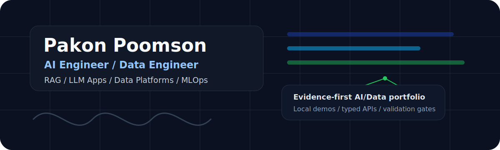

  

<h1 align="center">Pakon Poomson</h1>

  <strong>AI Engineer &amp; Data Engineer</strong> 
  RAG &middot; Agentic Workflows &middot; LLM Apps &middot; Data Platforms &middot; ML/MLOps &middot; Thai AI/Data Applications

  I build evidence-first AI and data systems with local-first demos, typed APIs, validation gates, evaluation artifacts, privacy-safe fixtures, and explicit limitations.

  
  
  
  

  
  
  
  
  

## Current Focus

- Building local-first AI/data systems with measurable evaluation and guardrails.
- Designing reproducible data pipelines and analytics platforms.
- Exploring RAG, agent workflows, Thai AI applications, and production-minded ML systems.

## Featured Engineering Work

### Data Engineering Platforms

<table>
<tr>
<td width="50%" valign="top">
  <h3><a href="https://github.com/Praciller/urban-mobility-data-platform">Urban Mobility Data Platform</a></h3>
  
<code>Data Engineering</code>

  
Local fixture ingestion, validation, DuckDB/dbt-style marts, Dagster definitions, read-only API, and dashboard evidence.

  
<strong>Stack:</strong> Python &middot; DuckDB &middot; dbt-duckdb &middot; Dagster &middot; FastAPI &middot; React

</td>
<td width="50%" valign="top">
  <h3><a href="https://github.com/Praciller/retailguard-data-platform">RetailGuard Data Platform</a></h3>
  
<code>Retail Data Platform</code>

  
Incremental Bronze extraction, protected PySpark Silver, blocking DuckDB quality gates, idempotency proof, and local evidence report.

  
<strong>Stack:</strong> Python &middot; PostgreSQL &middot; FastAPI &middot; PySpark &middot; DuckDB &middot; Airflow

</td>
</tr>
</table>

### RAG / Agentic AI Systems

<table>
<tr>
<td width="50%" valign="top">
  <h3><a href="https://github.com/Praciller/customer-support-rag-triage-agent">Customer Support RAG Triage Agent</a></h3>
  
<code>RAG / Agentic Workflow</code>

  
Typed seven-node LangGraph workflow with retrieval, grounding checks, provider fallback/cache controls, and deterministic offline evaluation.

  
<strong>Stack:</strong> Python &middot; FastAPI &middot; LangGraph &middot; Qdrant &middot; FastEmbed &middot; React

</td>
<td width="50%" valign="top">
  <h3><a href="https://github.com/Praciller/thai-procurement-intelligence">Thai Procurement Intelligence</a></h3>
  
<code>Public Data / Evidence AI</code>

  
Checksummed DGA snapshot, provenance-aware ingestion, bilingual evidence UI, deterministic retrieval evaluation, and cited assistant responses.

  
<strong>Stack:</strong> Next.js &middot; FastAPI &middot; PostgreSQL &middot; SQLAlchemy &middot; Public data

</td>
</tr>
</table>

### ML / MLOps

<table>
<tr>
<td width="50%" valign="top">
  <h3><a href="https://github.com/Praciller/thai-review-sentiment-intelligence">Thai Review Sentiment Intelligence</a></h3>
  
<code>Thai NLP / ML Governance</code>

  
Wisesight corpus workflow, Thai tokenization, macro-F1 model governance, confidence routing, explainability metadata, and monitoring demo.

  
<strong>Stack:</strong> Python &middot; PyThaiNLP &middot; scikit-learn &middot; FastAPI &middot; React

</td>
<td width="50%" valign="top">
  <h3><a href="https://github.com/Praciller/climate-co2-forecasting-ml">Climate CO2 Forecasting ML</a></h3>
  
<code>Forecasting / MLOps</code>

  
Chronological holdout, rolling-origin backtesting, interval coverage monitoring, metadata-only registry policy, and API/dashboard contracts.

  
<strong>Stack:</strong> Python &middot; statsmodels &middot; scikit-learn &middot; PyTorch &middot; FastAPI &middot; React

</td>
</tr>
</table>

### Multimodal / Product AI

<table>
<tr>
<td width="50%" valign="top">
  <h3><a href="https://github.com/Praciller/receipt-ai-expense-tracker">Receipt AI Expense Tracker</a></h3>
  
<code>Multimodal AI / Local Storage</code>

  
Mock-first multimodal parsing, Buddhist Era date normalization, schema/financial validation, and human review before IndexedDB persistence.

  
<strong>Stack:</strong> Next.js &middot; TypeScript &middot; Zod &middot; IndexedDB &middot; AI provider routing

</td>
<td width="50%" valign="top">
  <h3><a href="https://github.com/Praciller/ai-resume-matcher">AI Resume Matcher</a></h3>
  
<code>Document AI / Human Review</code>

  
PDF/JD validation, 9arm-first provider routing, strict Pydantic report schema, deterministic mock review path, and hiring-scope limitations.

  
<strong>Stack:</strong> FastAPI &middot; React &middot; Pydantic &middot; pypdf &middot; Multi-provider LLM routing

</td>
</tr>
</table>

<strong>Additional projects</strong>

- [explainable-cancer-diagnosis-ml](https://github.com/Praciller/explainable-cancer-diagnosis-ml) - Educational tabular ML explainability demo with SHAP assets and a medical disclaimer.
- [smart-qr-kitchen-pos](https://github.com/Praciller/smart-qr-kitchen-pos) - QR ordering and kitchen workflow demo with server-side price validation.
- [nextjs-langchain-ai-chatbot](https://github.com/Praciller/nextjs-langchain-ai-chatbot) - Mock-first Next.js chat demo with explicit provider opt-in.
- [AI-Product-Listing-Assistant](https://github.com/Praciller/AI-Product-Listing-Assistant) - Mock-first product listing draft workflow with optional Gemini image analysis.
- [my-portfolio](https://github.com/Praciller/my-portfolio) - Public technical portfolio site with typed project content.

## Technical Stack

**Data:** `Python` `SQL` `PySpark` `DuckDB` `dbt-style modeling` `Airflow` 
**AI:** `RAG` `LangGraph` `LLM Apps` `Provider Routing` `Evaluation` `Guardrails` 
**Backend:** `FastAPI` `Pydantic` `Docker` `CI/CD` 
**Frontend/Product:** `React` `Next.js` `TypeScript` `Tailwind CSS` 
**ML/MLOps:** `scikit-learn` `PyTorch` `Forecasting` `MLflow-style tracking` `Model Registry Metadata`

## Engineering Principles

<table>
<tr>
<td width="50%" valign="top">
  
<strong>Reproducibility</strong>

  <ul>
    <li>Local-first demos</li>
    <li>Deterministic fixtures</li>
    <li>Clear setup paths</li>
  </ul>
</td>
<td width="50%" valign="top">
  
<strong>Reliability</strong>

  <ul>
    <li>Validation gates</li>
    <li>CI-verifiable workflows</li>
    <li>Explicit limitations</li>
  </ul>
</td>
</tr>
<tr>
<td width="50%" valign="top">
  
<strong>AI System Safety</strong>

  <ul>
    <li>Grounded outputs</li>
    <li>Provider routing</li>
    <li>Human-review boundaries</li>
  </ul>
</td>
<td width="50%" valign="top">
  
<strong>Data Quality</strong>

  <ul>
    <li>Typed contracts</li>
    <li>Privacy-safe fixtures</li>
    <li>Evidence-based documentation</li>
  </ul>
</td>
</tr>
</table>

## Selected AI Credentials

- [AIAT Super AI Engineer Season 6: Foundation AI (Theory)](https://assessment.aiat.or.th/certificate/42a33cde-b540-4ad0-b294-b81cc7da9a74), 2026
- Anthropic Academy: Claude API, Claude Code, MCP, subagents, agent skills, and AI Fluency
- Google Cloud AI/ML skill badges: Vertex AI, Gemini, Imagen, Multimodal RAG, BigQuery ML, Document AI
- AIS Academy Prompt Engineering & Agentic AI

## Contact

[Email](mailto:pakon.poomson@gmail.com) &middot; [LinkedIn](https://www.linkedin.com/in/pakon-poomson/?locale=en-US) &middot; [Portfolio](https://pakon-portfolio.vercel.app/) &middot; [GitHub](https://github.com/Praciller)
