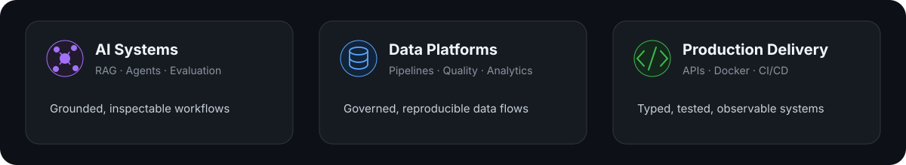

  

  
  
  

## Engineering focus

  

## Featured work

### [Customer Support RAG Triage Agent](https://github.com/Praciller/customer-support-rag-triage-agent)
**Production-shaped RAG workflow** · grounding checks · inspectable traces · deterministic evaluation · human-action routing  
[Repository](https://github.com/Praciller/customer-support-rag-triage-agent) · [Live demo](https://pracill-customer-support-rag-triage-agent.hf.space/) — inspect the triage workflow, retrieved evidence, grounding signals, and final routing decision.

### [EvalOps Lab](https://github.com/Praciller/evalops-lab)
**AI evaluation and reliability framework** · failure taxonomy · reproducible benchmarks · regression comparison · frozen releases  
[Repository](https://github.com/Praciller/evalops-lab) — evaluation-first engineering for retrieval, groundedness, failure analysis, and release decisions.

### [Thai Procurement Intelligence](https://github.com/Praciller/thai-procurement-intelligence)
**Bilingual public-data platform** · governed ingestion · provenance-aware search · cited AI assistance  
[Repository](https://github.com/Praciller/thai-procurement-intelligence) · [Live demo](https://thai-procurement-intelligence.vercel.app/) — explore the verified public snapshot, filters, search, budget analytics, and source-aware records.

### [RetailGuard Data Platform](https://github.com/Praciller/retailguard-data-platform)
**Incremental retail data platform** · PII protection · blocking quality gates · reconciliation · idempotency proof  
[Repository](https://github.com/Praciller/retailguard-data-platform) · [Live dashboard](https://lookerstudio.google.com/reporting/8e913aa6-d7c0-4367-991d-c173c8f05abb/page/2pS1F) — view the recruiter-facing analytics layer produced from the validated pipeline.

## Toolbox

**Core:** Python · SQL · FastAPI · PostgreSQL · PySpark · dbt · Docker · TypeScript · React / Next.js · GitHub Actions

<strong>More selected projects</strong>

 

| Project | What it demonstrates | Demo |
| --- | --- | --- |
| [Explainable Cancer Diagnosis ML](https://github.com/Praciller/explainable-cancer-diagnosis-ml) | Governed ML evaluation, explainability, responsible-use boundaries, and API/frontend delivery. | [Evidence interface](https://explainable-cancer-diagnosis-ml.vercel.app/) |
| [AI Resume Matcher](https://github.com/Praciller/ai-resume-matcher) | Validated PDF-to-job analysis, typed reports, provider routing, and deterministic local mode. | [Interactive demo](https://ai-resume-matcher-psi-one.vercel.app/) |
| [AI Product Listing Assistant](https://github.com/Praciller/AI-Product-Listing-Assistant) | Multimodal image-to-structured-commerce workflow with explicit provider and validation boundaries. | [Interactive demo](https://ai-product-listing-assistant.vercel.app/) |
| [Receipt AI Expense Tracker](https://github.com/Praciller/receipt-ai-expense-tracker) | Human-reviewed Thai/English receipt extraction, schema validation, and privacy-aware local persistence. | [Interactive demo](https://receipt-ai-expense-tracker-eta.vercel.app/) |
| [StockRush Go](https://github.com/Praciller/stockrush-go) | Concurrency correctness: 1,000 purchase attempts, exactly 100 reservations, zero overselling. | — |
| [Urban Mobility Data Platform](https://github.com/Praciller/urban-mobility-data-platform) | Validated ingestion, DuckDB/dbt marts, orchestration, and analytics API. | — |
| [Thai Review Sentiment Intelligence](https://github.com/Praciller/thai-review-sentiment-intelligence) | Thai sentiment classification with confidence routing, explanations, and monitoring. | — |
| [Climate CO₂ Forecasting](https://github.com/Praciller/climate-co2-forecasting-ml) | Leakage-safe forecasting, backtesting, interval evaluation, and anomaly signals. | — |

## Dream Logs Data

My canonical public workspace for engineering projects, experiments, evidence, and limitations across **AI Engineering, Data Engineering, and Software Systems**.

[**dreamlogsdata.com**](https://dreamlogsdata.com/) · [Projects](https://dreamlogsdata.com/projects) · [Articles](https://dreamlogsdata.com/articles) · [About](https://dreamlogsdata.com/about) · [RSS](https://dreamlogsdata.com/rss.xml)

## Credential

[AIAT Super AI Engineer Season 6 — Foundation AI (Theory)](https://assessment.aiat.or.th/certificate/42a33cde-b540-4ad0-b294-b81cc7da9a74) · 2026
