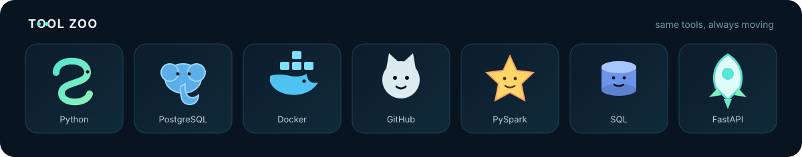

<h2>Hi, I'm Pakon 👋</h2>

<strong>AI Engineer · Data Engineer</strong>

  I build practical AI and data systems around evaluation, data quality, observability,
  and reliable pipelines. This GitHub is my workspace for personal projects,
  experiments, and engineering notes.

  
  
  

## What I'm building

| Project | Focus | Links |
| --- | --- | --- |
| **OpenDQ Observatory** | Data quality, drift, incidents, lineage, and deterministic RCA with optional AI-assisted explanations. | [Repo](https://github.com/Praciller/opendq-observatory) · [Live](https://opendq-observatory.vercel.app/) |
| **EvalOps Lab** | Reproducible RAG evaluation, failure analysis, provenance, and regression decisions backed by explicit evidence. | [Repo](https://github.com/Praciller/evalops-lab) · [Evidence console](https://praciller.github.io/evalops-lab/) |
| **VeriClaim AI** | Evidence-driven claim verification with bounded agents, stored provenance, and a deterministic public demo. | [Repo](https://github.com/Praciller/vericlaim-ai) · [Live](https://vericlaim-web.vercel.app) |

[More personal projects →](https://github.com/Praciller?tab=repositories)

## Toolbox

  

TypeScript · React / Next.js · Kafka / Flink · dbt · Java / Spring Boot

## Latest notes

<!-- BLOG-POST-LIST:START -->
- [AI หนึ่งคำถามใช้ไฟและน้ำแค่ไหน?](https://dreamlogsdata.com/articles/ai-prompt-energy-water/)
- [ข้อมูลผิดนิดเดียว ทำไมคำตอบสุดท้ายถึงผิดทั้งระบบ?](https://dreamlogsdata.com/articles/data-quality-small-errors-big-impact/)
- [AI เก่งขึ้นทุกวัน แล้วเราล่ะเก่งขึ้นด้วยไหม? บทเรียนจาก AI NEXT by BIZCORE](https://dreamlogsdata.com/articles/ai-next-bizcore-context-workflow-thinking/)
<!-- BLOG-POST-LIST:END -->

  
<strong>GitHub stats</strong>

   
  

    
    
  

