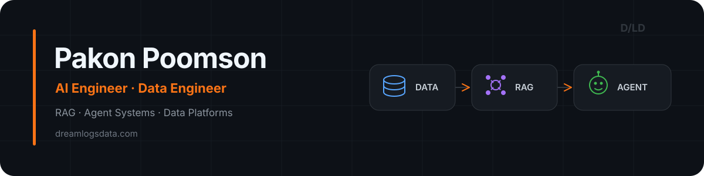

  

<h1 align="center">Pakon Poomson</h1>

  <strong>AI Engineer building reliable RAG and agent systems on production-minded data platforms.</strong>

  Python · FastAPI · LangGraph · PostgreSQL · dbt · PySpark · React

  <a href="https://pakon-portfolio.vercel.app/">Portfolio</a> ·
  <a href="https://www.linkedin.com/in/pakon-poomson/?locale=en-US">LinkedIn</a> ·
  <a href="mailto:pakon.poomson@gmail.com">Email</a>

  Start with
  <a href="https://github.com/Praciller/customer-support-rag-triage-agent">RAG Triage</a> ·
  <a href="https://github.com/Praciller/retailguard-data-platform">RetailGuard</a> ·
  <a href="https://github.com/Praciller/thai-procurement-intelligence">Thai Procurement Intelligence</a> ·
  <a href="https://github.com/Praciller/explainable-cancer-diagnosis-ml">Explainable Cancer</a> ·
  <a href="https://github.com/Praciller/urban-mobility-data-platform">Urban Mobility</a> ·
  <a href="https://github.com/Praciller/thai-review-sentiment-intelligence">Thai Review</a>

## Selected engineering results

- [Customer Support RAG Triage Agent](https://github.com/Praciller/customer-support-rag-triage-agent) — Built a seven-node workflow with retrieval, grounding checks, inspectable traces, and deterministic evaluation.
- [RetailGuard Data Platform](https://github.com/Praciller/retailguard-data-platform) — Built an incremental retail platform with PII protection, blocking quality gates, reconciliation, and two-run idempotency proof.
- [StockRush Go](https://github.com/Praciller/stockrush-go) — Demonstrated 1,000 concurrent purchase attempts, exactly 100 successful reservations, and zero overselling.

## Start Here

### [Customer Support RAG Triage Agent](https://github.com/Praciller/customer-support-rag-triage-agent)

A typed support workflow that retrieves relevant cases, checks grounding, exposes every decision in a trace, and routes the final action to a human reviewer.

**Core stack:** Python · FastAPI · LangGraph · Qdrant · FastEmbed · React 
[Repository](https://github.com/Praciller/customer-support-rag-triage-agent) · [Live demo](https://pracill-customer-support-rag-triage-agent.hf.space/)

### [RetailGuard Data Platform](https://github.com/Praciller/retailguard-data-platform)

An incremental retail pipeline that protects customer data and blocks warehouse loads when quality or reconciliation checks fail.

**Core stack:** Python · PostgreSQL · FastAPI · PySpark · DuckDB · Airflow 
[Repository](https://github.com/Praciller/retailguard-data-platform) · [Live dashboard](https://lookerstudio.google.com/reporting/8e913aa6-d7c0-4367-991d-c173c8f05abb/page/2pS1F)

### [Thai Procurement Intelligence](https://github.com/Praciller/thai-procurement-intelligence)

A bilingual public-data platform that keeps source provenance visible across governed ingestion, search, analytics, and cited AI assistance.

**Core stack:** Next.js · FastAPI · PostgreSQL · pgvector · SQLAlchemy 
[Repository](https://github.com/Praciller/thai-procurement-intelligence) · [Live demo](https://thai-procurement-intelligence.vercel.app/)

Official/local snapshot evidence remains separate from the hosted synthetic demo.

## Additional selected projects

| Project | Engineering focus |
| --- | --- |
| [urban-mobility-data-platform](https://github.com/Praciller/urban-mobility-data-platform) | Validated mobility ingestion, DuckDB/dbt marts, orchestration, and a read-only analytics API. |
| [thai-review-sentiment-intelligence](https://github.com/Praciller/thai-review-sentiment-intelligence) | Thai sentiment classification with model governance, confidence routing, explanations, and monitoring. |
| [climate-co2-forecasting-ml](https://github.com/Praciller/climate-co2-forecasting-ml) | Leakage-safe time-series forecasting with backtesting, interval evaluation, anomaly signals, and API contracts. |
| [stockrush-go](https://github.com/Praciller/stockrush-go) | Concurrency-safe flash-sale reservations with atomic inventory updates and reproducible zero-oversell evidence. |
| [receipt-ai-expense-tracker](https://github.com/Praciller/receipt-ai-expense-tracker) | Human-reviewed Thai and English receipt parsing with schema validation and browser-local persistence. |
| [ai-resume-matcher](https://github.com/Praciller/ai-resume-matcher) | Validated PDF-to-job analysis with typed reports, provider routing, and hiring-scope safeguards. |
| [explainable-cancer-diagnosis-ml](https://github.com/Praciller/explainable-cancer-diagnosis-ml) | Educational tabular ML comparison with SHAP explanations and an explicit medical disclaimer. |
| [smart-qr-kitchen-pos](https://github.com/Praciller/smart-qr-kitchen-pos) | QR ordering and kitchen operations with server-validated pricing and controlled ticket transitions. |
| [Fyrre---Magazine-Website-](https://github.com/Praciller/Fyrre---Magazine-Website-) | Accessible, responsive editorial browsing built from a Figma community design with tested content routes. |
| [my-portfolio](https://github.com/Praciller/my-portfolio) | Recruiter-facing technical evidence hub for public AI and data engineering work. |

## Core stack

**AI systems:** RAG · LangGraph · retrieval evaluation · grounding checks · provider routing 
**Data platforms:** PostgreSQL · PySpark · DuckDB · dbt · Airflow · data quality 
**Application delivery:** Python · FastAPI · TypeScript · React · Next.js · Docker · GitHub Actions

## Credentials

- [AIAT Super AI Engineer Season 6 — Foundation AI (Theory)](https://assessment.aiat.or.th/certificate/42a33cde-b540-4ad0-b294-b81cc7da9a74), 2026

## Contact

For AI engineering opportunities, please use the portfolio, LinkedIn, or email links above.
