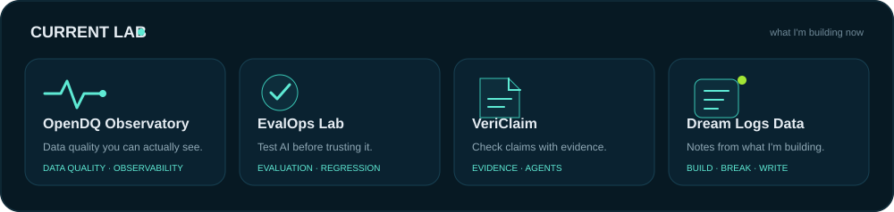
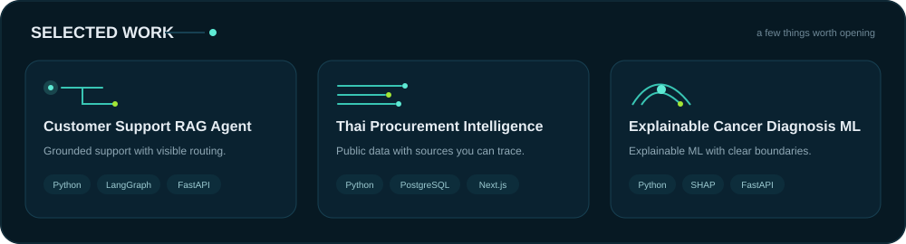

  

  <a href="https://dreamlogsdata.com/">Dream Logs Data</a> ·
  <a href="https://www.linkedin.com/in/pakon-poomson/?locale=en-US">LinkedIn</a> ·
  <a href="mailto:pakon.poomson@gmail.com">Email</a>

AI Engineer · Data Engineer

  

  <a href="https://github.com/Praciller/opendq-observatory">OpenDQ</a> ·
  <a href="https://github.com/Praciller/evalops-lab">EvalOps</a> ·
  <a href="https://github.com/Praciller/vericlaim-ai">VeriClaim</a> ·
  <a href="https://dreamlogsdata.com/">Dream Logs Data</a>

  

  <a href="https://github.com/Praciller/customer-support-rag-triage-agent">RAG Repo</a> / <a href="https://pracill-customer-support-rag-triage-agent.hf.space/">Demo</a> ·
  <a href="https://github.com/Praciller/thai-procurement-intelligence">Procurement Repo</a> / <a href="https://thai-procurement-intelligence.vercel.app/">Demo</a> ·
  <a href="https://github.com/Praciller/explainable-cancer-diagnosis-ml">ML Repo</a> / <a href="https://dreamlogsdata.com/en/projects/explainable-cancer-diagnosis">Story</a>

<a href="https://github.com/Praciller?tab=repositories">more projects →</a>

  

TypeScript · React / Next.js · dbt

### Latest notes
<!-- BLOG-POST-LIST:START -->
- [AI หนึ่งคำถามใช้ไฟและน้ำแค่ไหน?](https://dreamlogsdata.com/articles/ai-prompt-energy-water/)
- [ข้อมูลผิดนิดเดียว ทำไมคำตอบสุดท้ายถึงผิดทั้งระบบ?](https://dreamlogsdata.com/articles/data-quality-small-errors-big-impact/)
- [AI เก่งขึ้นทุกวัน แล้วเราล่ะเก่งขึ้นด้วยไหม? บทเรียนจาก AI NEXT by BIZCORE](https://dreamlogsdata.com/articles/ai-next-bizcore-context-workflow-thinking/)
<!-- BLOG-POST-LIST:END -->

### GitHub signals

  
  

  <a href="https://dreamlogsdata.com/">dreamlogsdata.com</a> ·
  <a href="https://www.linkedin.com/in/pakon-poomson/?locale=en-US">LinkedIn</a> ·
  <a href="mailto:pakon.poomson@gmail.com">Email</a>

