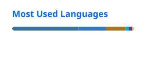

<h2>Hi, I'm Pakon 👋</h2>

<strong>AI Engineer · Data Engineer</strong>

  I build practical AI and data systems around evaluation, data quality,
  observability, reliable pipelines, and evidence-backed automation.

  
  
  

## Selected projects

| Project | Focus | Explore |
| --- | --- | --- |
| **OpenDQ Observatory** | Data quality, drift, incidents, lineage, deterministic RCA, and bounded AI explanations. | [Repo](https://github.com/Praciller/opendq-observatory) · [Live](https://opendq-observatory.vercel.app/) |
| **EvalOps Lab** | Reproducible RAG evaluation, provenance, failure analysis, and regression decisions. | [Repo](https://github.com/Praciller/evalops-lab) · [Evidence](https://praciller.github.io/evalops-lab/) |
| **VeriClaim AI** | Evidence-driven claim verification with bounded agents, provenance, and deterministic evaluation. | [Repo](https://github.com/Praciller/vericlaim-ai) · [Live](https://vericlaim-web.vercel.app) |
| **Urban Mobility Data Platform** | Ingestion, data quality, DuckDB/dbt marts, Dagster orchestration, APIs, and analytics. | [Repo](https://github.com/Praciller/urban-mobility-data-platform) · [Live](https://praciller-urban-mobility-dashboard.onrender.com) |
| **Thai Public Procurement Intelligence** | Governed public-data ingestion, provenance-aware search, analytics, and cited answers. | [Repo](https://github.com/Praciller/thai-procurement-intelligence) · [Live](https://thai-procurement-intelligence.vercel.app/) |
| **OpsPulse AI** | Java/Spring Boot operations intelligence with deterministic risk rules and bounded AI assistance. | [Repo](https://github.com/Praciller/opspulse-ai) |

[More public projects →](https://github.com/Praciller?tab=repositories)

## Core stack

  
  
  
  
  
  
  
  
  
  
  
  

## Latest notes

<!-- BLOG-POST-LIST:START -->
- [จาก Prototype สู่ Production: อะไรทำให้ AI Project ไม่จบแค่ Demo](https://dreamlogsdata.com/writing/prototype-to-production-ai/)
- [Observability สำหรับ AI: เราจะรู้ได้อย่างไรว่าระบบ AI กำลังผิด ทั้งที่มันยังตอบได้อยู่](https://dreamlogsdata.com/writing/ai-observability/)
- [Human-in-the-Loop ยังจำเป็นไหมในยุค AI Agent?](https://dreamlogsdata.com/writing/human-in-the-loop-ai/)
<!-- BLOG-POST-LIST:END -->

  
<strong>GitHub stats</strong>

   
  

    
    
  

